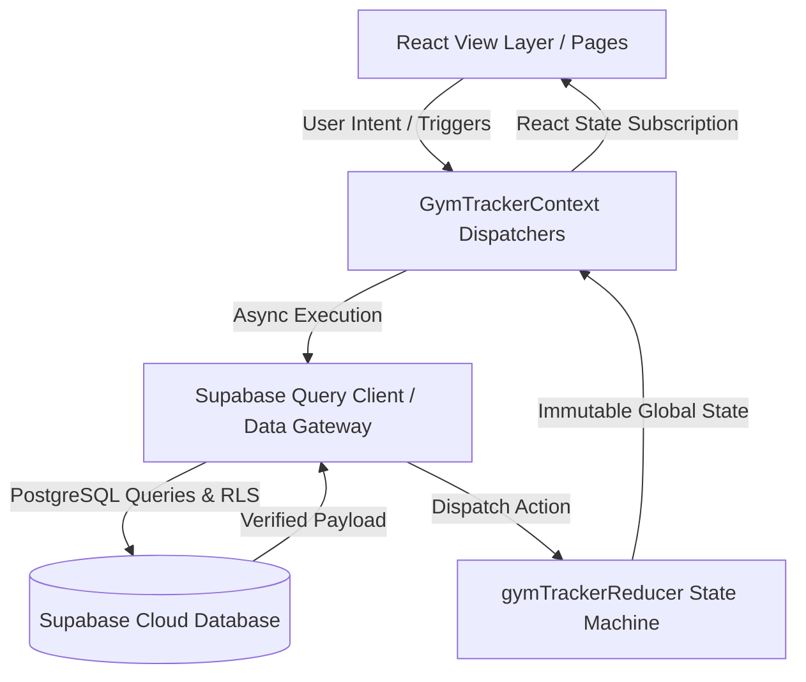
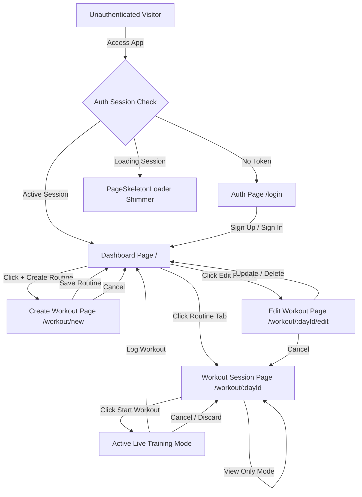
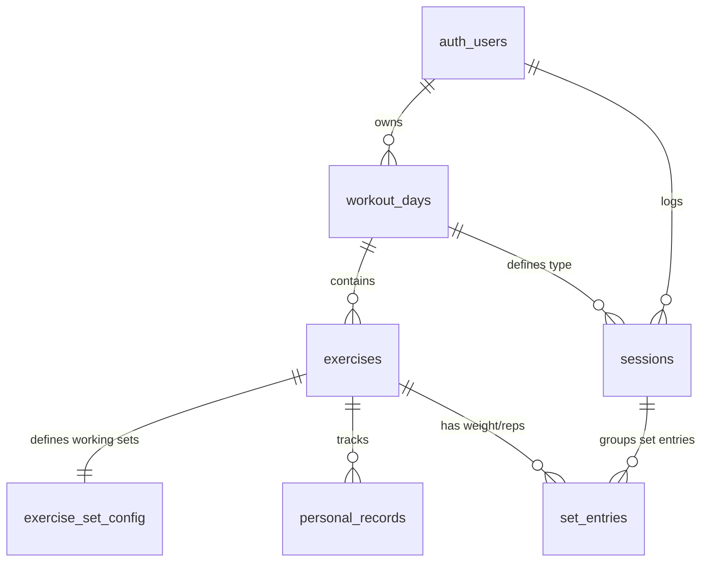
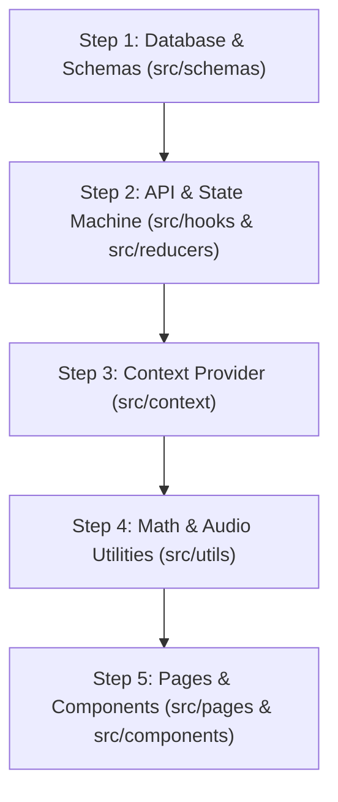

# System Architecture & Contributor Guide — RepStack

This document details the architectural layout, design patterns, database schemas, state management systems, component hierarchy, and user navigation routes of the RepStack Gym Tracker. It is designed to help developers and contributors quickly ramp up, study the architecture, and understand the entire codebase.

---

## 🏗️ Architectural Overview & Design Patterns

RepStack follows modern React software engineering best practices with a focus on **type safety**, **unidirectional data flow**, **declarative state management**, and **performance optimization**:



### Key Design Patterns Implemented:

1. **Unidirectional Data Flow (Flux / MVI Pattern)**:
   - State flows strictly downwards from `GymTrackerContext` to components.
   - User actions trigger pure functions in `GymTrackerContext`, which call the async database gateway and dispatch immutable actions to `gymTrackerReducer`.
   - The UI never mutates state directly.

2. **Database Gateway & Defensive Query Layer (`useSupabaseQuery.ts`)**:
   - Isolates all `@supabase/supabase-js` API calls from the React component tree.
   - Implements defensive fallbacks (e.g., handles missing columns or network interruptions gracefully without crashing the app).

3. **Runtime Schema Validation (`Zod`)**:
   - Located in `src/schemas/`.
   - Validates all incoming database entities at runtime to prevent malformed data from propagating into state.

4. **Zero-Dependency Web Audio API Synthesizer (`audioUtils.ts`)**:
   - Uses native browser `AudioContext` with sine/triangle oscillators to generate clean, musical notification chimes for rest timers and PR celebrations without external MP3 dependencies or CORS issues.

5. **Code-Splitting & Lazy Loading (`React.lazy` + `Suspense`)**:
   - Configured in `src/App.tsx` with Rollup `manualChunks` in `vite.config.ts`.
   - Splits the application into isolated route chunks under 35 kB, paired with an athletic dark `<PageSkeletonLoader />` during initial hydration.

---

## 🗺️ User Flow & Routing Topology

RepStack uses **React Router v6** with **code-splitting (`React.lazy()`)**. Protected pages are wrapped in a `<ProtectedRoute>` component that verifies authentication status via the `useGymTracker` context hook.



### Route & Code-Split Chunks Index
- **`/login` (`Auth.tsx`)**: Lazy chunk (`~4.5 kB`). Houses email login, registration forms, and password resets.
- **`/` (`Dashboard.tsx`)**: Lazy chunk (`~33 kB`). The central Hub displaying active routines, GitHub-style 52-week activity heatmap, exercise progression charts, and past workout history.
- **`/workout/:dayId` (`WorkoutSession.tsx`)**: Lazy chunk (`~32 kB`). The core workout page supporting both **View-Only Preview** and **Live Active Training Mode** with stopwatch duration, rest timer, and PR tracking.
- **`/workout/new` (`CreateWorkout.tsx`)**: Lazy chunk (`~6.5 kB`). Dedicated routine builder page to create new workout days.
- **`/workout/:dayId/edit` (`EditWorkout.tsx`)**: Lazy chunk (`~8.6 kB`). Routine modifications page allowing inline renames, additions/deletions of exercises, set configuration counts, or cascading deletion of the routine.
- **`<PageSkeletonLoader />`**: Reusable instant skeleton loader that provides athletic dark shimmer placeholders during authentication resolution and route transitions.

---

## 📱 Page & Component Directory

### 1. `src/pages/`
| Page File | Route | Description & Key Responsibilities |
| :--- | :--- | :--- |
| [`Auth.tsx`](file:///d:/React-Course/My-React-projects/Gym-Tracker/src/pages/Auth.tsx) | `/login` | Authentication form handling login, sign up, and validation feedback. |
| [`Dashboard.tsx`](file:///d:/React-Course/My-React-projects/Gym-Tracker/src/pages/Dashboard.tsx) | `/` | Master hub featuring the 52-week contribution heatmap, volume charts, exercise PR progression line charts, and quick-launch routine buttons. |
| [`WorkoutSession.tsx`](file:///d:/React-Course/My-React-projects/Gym-Tracker/src/pages/WorkoutSession.tsx) | `/workout/:dayId` | Core training screen featuring View-Only mode, live stopwatch, sticky top-anchored rest timer, editable exercise cards, and cancel confirmation modal. |
| [`CreateWorkout.tsx`](file:///d:/React-Course/My-React-projects/Gym-Tracker/src/pages/CreateWorkout.tsx) | `/workout/new` | Multi-exercise routine builder with target set configurations and Cancel button. |
| [`EditWorkout.tsx`](file:///d:/React-Course/My-React-projects/Gym-Tracker/src/pages/EditWorkout.tsx) | `/workout/:dayId/edit` | Routine editor for adding/removing exercises, modifying target sets, deleting routines, or canceling changes. |

---

### 2. `src/components/`
| Component | Responsibility |
| :--- | :--- |
| [`WorkoutHeatmap.tsx`](file:///d:/React-Course/My-React-projects/Gym-Tracker/src/components/WorkoutHeatmap.tsx) | GitHub-style 52-week (364-day) activity matrix with intensity color grading, live streak calculation (🔥 Current & 🏆 Best), and interactive hover popovers. |
| [`RestTimer.tsx`](file:///d:/React-Course/My-React-projects/Gym-Tracker/src/components/RestTimer.tsx) | Top-anchored (`top-16`) floating countdown timer with 30s/1m/90s/2m/3m/5m presets, audio chime trigger, circular SVG progress, and sound mute toggle. |
| [`ExerciseCard.tsx`](file:///d:/React-Course/My-React-projects/Gym-Tracker/src/components/ExerciseCard.tsx) | Exercise card supporting both read-only preview mode and active editing mode. Displays PR badges, last logged weight/reps, inline `⏱️ Rest` launcher, and set controls. |
| [`ExerciseProgressionChart.tsx`](file:///d:/React-Course/My-React-projects/Gym-Tracker/src/components/ExerciseProgressionChart.tsx) | Interactive SVG line chart rendering chronological progression, estimated 1RM calculations, and volume curves for any selected exercise. |
| [`ConfirmationModal.tsx`](file:///d:/React-Course/My-React-projects/Gym-Tracker/src/components/ConfirmationModal.tsx) | Athletic dark modal replacing native browser `confirm()`, supporting destructive actions (e.g. discarding active sessions or deleting routines). |
| [`StatusAlert.tsx`](file:///d:/React-Course/My-React-projects/Gym-Tracker/src/components/StatusAlert.tsx) | Reusable inline banner for `"success"`, `"warning"`, `"error"`, and `"info"` messages. |
| [`ToastNotification.tsx`](file:///d:/React-Course/My-React-projects/Gym-Tracker/src/components/ToastNotification.tsx) | Floating toast banner with auto-dismiss timers for instant feedback. |
| [`PRCelebration.tsx`](file:///d:/React-Course/My-React-projects/Gym-Tracker/src/components/PRCelebration.tsx) | Animated badge modal celebrating new Personal Records broken during training. |
| [`SideDrawer.tsx`](file:///d:/React-Course/My-React-projects/Gym-Tracker/src/components/SideDrawer.tsx) | Slide-out navigation drawer with user profile rename modal, routine list, and sign-out action. |
| [`BottomTabBar.tsx`](file:///d:/React-Course/My-React-projects/Gym-Tracker/src/components/BottomTabBar.tsx) | Sticky bottom navigation bar allowing seamless switching between workout days and stats. |
| [`PageSkeletonLoader.tsx`](file:///d:/React-Course/My-React-projects/Gym-Tracker/src/components/PageSkeletonLoader.tsx) | Dark shimmer skeleton loader for route transitions and auth hydration. |

---

## 🗄️ Database Schema & Relational Model

The backend is built on **Supabase (PostgreSQL)** with Row Level Security (RLS) enabled. Primary keys are configured as auto-incrementing numbers (`int8`).



### Table Definitions

1. **`workout_days`**:
   - `id` (int8, PK): Auto-incrementing identifier.
   - `user_id` (uuid, FK): Points to `auth.users.id` (cascade delete).
   - `name` (text): e.g., "Push Day".
   - `sort_order` (int4): For ordering navigation tabs.

2. **`exercises`**:
   - `id` (int8, PK): Auto-incrementing identifier.
   - `workout_day_id` (int8, FK): Points to `workout_days.id` (cascade delete).
   - `name` (text): e.g., "Incline Chest Press".
   - `notes` (text): Details or instructions (nullable).
   - `image_url` (text): Custom photo uploads (nullable).
   - `sort_order` (int4): Display order within the day's routine.

3. **`exercise_set_config`**:
   - `id` (int8, PK): Auto-incrementing identifier.
   - `exercise_id` (int8, FK, UNIQUE): Points to `exercises.id` (cascade delete).
   - `working_set_count` (int4): Number of target sets for the exercise (default: 3).

4. **`sessions`**:
   - `id` (int8, PK): Auto-incrementing identifier.
   - `user_id` (uuid, FK): Points to `auth.users.id` (cascade delete).
   - `workout_day_id` (int8, FK): Points to `workout_days.id` (cascade delete).
   - `performed_on` (date): The training calendar date (`YYYY-MM-DD`).
   - `duration_seconds` (int4): Total elapsed duration of the workout session in seconds (default: 0).

5. **`set_entries`**:
   - `id` (int8, PK): Auto-incrementing identifier.
   - `session_id` (int8, FK): Points to `sessions.id` (cascade delete).
   - `exercise_id` (int8, FK): Points to `exercises.id` (cascade delete).
   - `set_type` (text): `'warmup'` or `'working'`.
   - `set_index` (int4): Index of the set (0-indexed).
   - `weight` (numeric): Weight lifted (nullable).
   - `reps` (int4): Repetitions completed (nullable).

6. **`personal_records`**:
   - `id` (int8, PK): Auto-incrementing identifier.
   - `exercise_id` (int8, FK, UNIQUE): Points to `exercises.id` (cascade delete).
   - `max_weight` (numeric): Maximum weight successfully lifted.
   - `max_weight_reps` (int4): Reps completed at max weight.
   - `achieved_on` (date): Date of achievement.
   - `previous_weight` (numeric): History trace (nullable).

---

## 🔒 Row Level Security (RLS) SQL Policies

Run this complete script in the Supabase SQL Editor (`Dashboard -> SQL Editor -> New Query`) to ensure all permissions and policies are active:

```sql
-- 1. Grant table & sequence permissions to authenticated users
GRANT ALL ON ALL TABLES IN SCHEMA public TO authenticated;
GRANT ALL ON ALL SEQUENCES IN SCHEMA public TO authenticated;

-- 2. Enable RLS on all tables
ALTER TABLE public.workout_days ENABLE ROW LEVEL SECURITY;
ALTER TABLE public.exercises ENABLE ROW LEVEL SECURITY;
ALTER TABLE public.exercise_set_config ENABLE ROW LEVEL SECURITY;
ALTER TABLE public.sessions ENABLE ROW LEVEL SECURITY;
ALTER TABLE public.set_entries ENABLE ROW LEVEL SECURITY;
ALTER TABLE public.personal_records ENABLE ROW LEVEL SECURITY;

-- 3. Create RLS Policies
CREATE POLICY "Users can manage their own workout days"
ON public.workout_days FOR ALL TO authenticated
USING (auth.uid() = user_id) WITH CHECK (auth.uid() = user_id);

CREATE POLICY "Users can manage exercises in their own workout days"
ON public.exercises FOR ALL TO authenticated
USING (EXISTS (SELECT 1 FROM public.workout_days WHERE workout_days.id = exercises.workout_day_id AND workout_days.user_id = auth.uid()))
WITH CHECK (EXISTS (SELECT 1 FROM public.workout_days WHERE workout_days.id = exercises.workout_day_id AND workout_days.user_id = auth.uid()));

CREATE POLICY "Users can manage config for their own exercises"
ON public.exercise_set_config FOR ALL TO authenticated
USING (EXISTS (SELECT 1 FROM public.exercises JOIN public.workout_days ON workout_days.id = exercises.workout_day_id WHERE exercises.id = exercise_set_config.exercise_id AND workout_days.user_id = auth.uid()))
WITH CHECK (EXISTS (SELECT 1 FROM public.exercises JOIN public.workout_days ON workout_days.id = exercises.workout_day_id WHERE exercises.id = exercise_set_config.exercise_id AND workout_days.user_id = auth.uid()));

CREATE POLICY "Users can manage their own sessions"
ON public.sessions FOR ALL TO authenticated
USING (auth.uid() = user_id) WITH CHECK (auth.uid() = user_id);

CREATE POLICY "Users can manage set entries for their own sessions"
ON public.set_entries FOR ALL TO authenticated
USING (EXISTS (SELECT 1 FROM public.sessions WHERE sessions.id = set_entries.session_id AND sessions.user_id = auth.uid()))
WITH CHECK (EXISTS (SELECT 1 FROM public.sessions WHERE sessions.id = set_entries.session_id AND sessions.user_id = auth.uid()));

CREATE POLICY "Users can manage personal records for their exercises"
ON public.personal_records FOR ALL TO authenticated
USING (EXISTS (SELECT 1 FROM public.exercises JOIN public.workout_days ON workout_days.id = exercises.workout_day_id WHERE exercises.id = personal_records.exercise_id AND workout_days.user_id = auth.uid()))
WITH CHECK (EXISTS (SELECT 1 FROM public.exercises JOIN public.workout_days ON workout_days.id = exercises.workout_day_id WHERE exercises.id = personal_records.exercise_id AND workout_days.user_id = auth.uid()));
```

---

## ⚡ State Management Flow (MVI Pattern)

RepStack implements the Model-View-Intent pattern by combining the React **Context API** (`GymTrackerContext.tsx`) and the **useReducer** hook (`gymTrackerReducer.ts`). 

### Central Reducer Action Index
All database operations are synchronized locally through these actions in `gymTrackerReducer.ts`:
- `START_LOADING` / `SET_ERROR`: Standard API request cycle handlers.
- `SET_ALL_DATA`: Invoked on login; hydrates the app state.
- `ADD_WORKOUT_DAY` / `UPDATE_WORKOUT_DAY` / `DELETE_WORKOUT_DAY`: Handles routines CRUD.
- `ADD_EXERCISE` / `UPDATE_EXERCISE` / `REMOVE_EXERCISE`: Handles routine exercise configs.
- `UPDATE_EXERCISE_CONFIG`: Modifies target sets counts.
- `LOG_SESSION`: Commits a session log, inserts set entries, records elapsed duration, and updates personal records (PR) simultaneously.

---

## 🧭 Codebase Study & Learning Roadmap for Junior Developers

Follow this 5-step roadmap to thoroughly understand and master this codebase:



### 1. Step 1: Database & Schemas (`src/schemas/` & `src/types/`)
- Read the Zod schemas (`workoutDays.ts`, `exercises.ts`, `sessions.ts`, `setEntries.ts`, `personalRecords.ts`).
- Understand how database rows are validated at runtime and mapped into strongly typed TypeScript entities.

### 2. Step 2: Database Queries & Pure State Machine (`src/hooks/` & `src/reducers/`)
- Inspect [`src/hooks/useSupabaseQuery.ts`](file:///d:/React-Course/My-React-projects/Gym-Tracker/src/hooks/useSupabaseQuery.ts): Study how queries, inserts, duration logging, and defensive error handling are written using `@supabase/supabase-js`.
- Inspect [`src/reducers/gymTrackerReducer.ts`](file:///d:/React-Course/My-React-projects/Gym-Tracker/src/reducers/gymTrackerReducer.ts): Understand pure state transitions, immutable array updates, and how state normalization prevents duplicate entity trees.

### 3. Step 3: Central Context Provider (`src/context/GymTrackerContext.tsx`)
- Study how the auth lifecycle listener (`supabase.auth.onAuthStateChange`) triggers automatic table hydration on sign-in and resets state on logout.
- See how action functions (`addWorkoutDay`, `logSession`, etc.) bridge the UI with query hooks and reducer dispatches.

### 4. Step 4: Normalization, Math Formulas & Web Audio API (`src/utils/`)
- Review [`src/utils/exerciseUtils.ts`](file:///d:/React-Course/My-React-projects/Gym-Tracker/src/utils/exerciseUtils.ts):
  - `normalizeExerciseName`: Allows identical exercises across different workout days to share history and PRs.
  - `calculate1RM`: Uses the Epley formula (`Weight * (1 + Reps / 30)`) to derive estimated One Rep Max.
  - `getExerciseProgressionTimeline`: Generates chronological data points for SVG line charts.
- Review [`src/utils/audioUtils.ts`](file:///d:/React-Course/My-React-projects/Gym-Tracker/src/utils/audioUtils.ts):
  - Uses native `AudioContext` to synthesize 3-tone chimes for timer expiration and workout completion.

### 5. Step 5: Routing, Workflows & UI Components (`src/App.tsx`, `src/pages/`, `src/components/`)
- Study [`src/App.tsx`](file:///d:/React-Course/My-React-projects/Gym-Tracker/src/App.tsx) for route chunking (`React.lazy`) and `<Suspense>`.
- Study [`src/pages/WorkoutSession.tsx`](file:///d:/React-Course/My-React-projects/Gym-Tracker/src/pages/WorkoutSession.tsx) to understand the **View-Only Preview** vs. **Live Active Training** state machine.
- Explore [`src/components/WorkoutHeatmap.tsx`](file:///d:/React-Course/My-React-projects/Gym-Tracker/src/components/WorkoutHeatmap.tsx) for 52-week calendar matrix calculations and streak tracking.
- Review [`src/components/RestTimer.tsx`](file:///d:/React-Course/My-React-projects/Gym-Tracker/src/components/RestTimer.tsx) for countdown timers and sound triggers.
- Review [`src/components/StatusAlert.tsx`](file:///d:/React-Course/My-React-projects/Gym-Tracker/src/components/StatusAlert.tsx), [`ToastNotification.tsx`](file:///d:/React-Course/My-React-projects/Gym-Tracker/src/components/ToastNotification.tsx), and [`ConfirmationModal.tsx`](file:///d:/React-Course/My-React-projects/Gym-Tracker/src/components/ConfirmationModal.tsx) for the unified feedback architecture.
