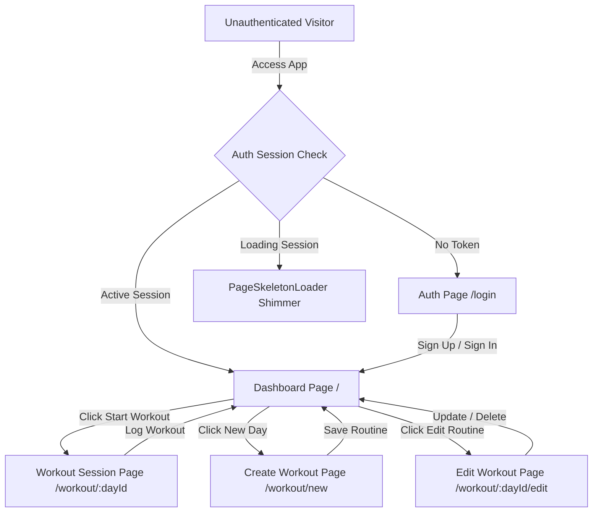
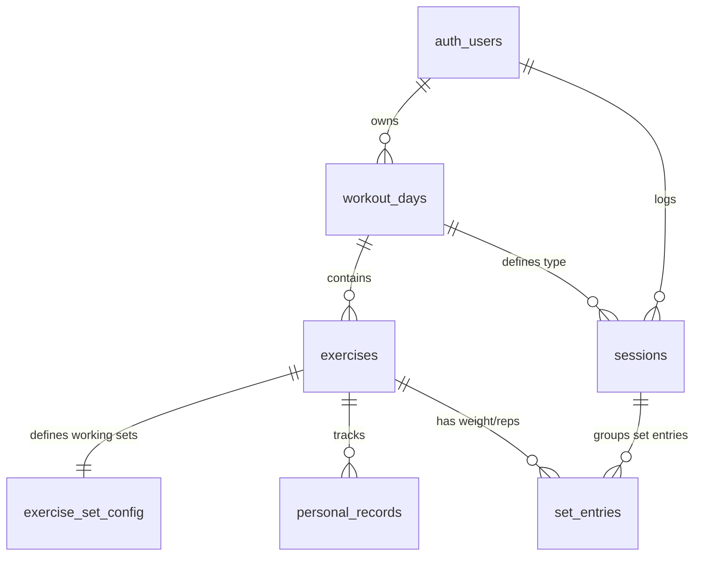
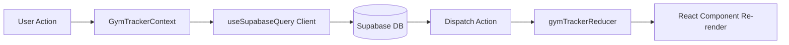
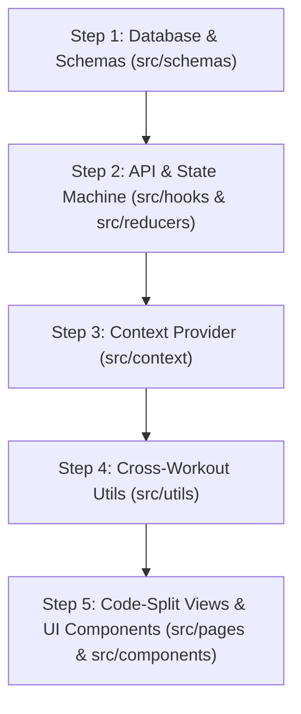

# System Architecture & Contributor Guide — RepStack

This document details the architectural layout, database schemas, state management systems, and user navigation routes of the RepStack Gym Tracker. It is designed to help junior developers and contributors quickly ramp up, study the architecture, and make modifications to the codebase.

---

## 🗺️ User Flow & Routing Topology

RepStack uses **React Router v6** with **code-splitting (`React.lazy()`)** for high performance. Protected pages are wrapped in a `<ProtectedRoute>` component that verifies authentication status via the `useGymTracker` context hook.



### Route & Code-Split Chunks Index
- **`/login` (`Auth.tsx`)**: Lazy chunk (`~4.5 kB`). Houses email login and registration forms. Built-in routing redirects back to the dashboard if a valid session exists.
- **`/` (`Dashboard.tsx`)**: Lazy chunk (`~26 kB`). The central Hub displaying active routines, exercise progression line charts, past workouts history, and weekly volume graphs.
- **`/workout/:dayId` (`WorkoutSession.tsx`)**: Lazy chunk (`~28 kB`). The active workout dashboard displaying warmup/working set inputs, customizable rest timers, and the workout completion commit action.
- **`/workout/new` (`CreateWorkout.tsx`)**: Lazy chunk (`~6 kB`). Dedicated routine configuration page to build a new training day tab.
- **`/workout/:dayId/edit` (`EditWorkout.tsx`)**: Lazy chunk (`~10 kB`). Routine modifications page allowing inline renames, additions/deletions of exercises, set configuration counts, or cascading deletion of the entire day.
- **`<PageSkeletonLoader />`**: Reusable instant skeleton loader that provides athletic dark shimmer placeholders during authentication resolution and route transitions in `<Suspense>`.

---

## 🗄️ Database Schema & Relational Model

The backend is built on **Supabase (PostgreSQL)** with Row Level Security (RLS) enabled. Primary keys are configured as auto-incrementing numbers (`int8`).



### Table Definitions

1. **`workout_days`**:
   - `id` (int8, PK): Auto-incrementing identifier.
   - `user_id` (uuid, FK): Points to `auth.users.id` (cascade delete).
   - `name` (text): e.g., "Push Day".
   - `sort_order` (int4): For ordering navigation tabs.

2. **`exercises`**:
   - `id` (int8, PK): Auto-incrementing identifier.
   - `workout_day_id` (int8, FK): Points to `workout_days.id` (cascade delete).
   - `name` (text): e.g., "Incline Chest Press".
   - `notes` (text): Details or instructions (nullable).
   - `image_url` (text): Custom photo uploads (nullable).
   - `sort_order` (int4): Display order within the day's routine.

3. **`exercise_set_config`**:
   - `id` (int8, PK): Auto-incrementing identifier.
   - `exercise_id` (int8, FK, UNIQUE): Points to `exercises.id` (cascade delete).
   - `working_set_count` (int4): Number of target sets for the exercise (default: 3).

4. **`sessions`**:
   - `id` (int8, PK): Auto-incrementing identifier.
   - `user_id` (uuid, FK): Points to `auth.users.id` (cascade delete).
   - `workout_day_id` (int8, FK): Points to `workout_days.id` (cascade delete).
   - `performed_on` (date): The training calendar date.

5. **`set_entries`**:
   - `id` (int8, PK): Auto-incrementing identifier.
   - `session_id` (int8, FK): Points to `sessions.id` (cascade delete).
   - `exercise_id` (int8, FK): Points to `exercises.id` (cascade delete).
   - `set_type` (text): `'warmup'` or `'working'`.
   - `set_index` (int4): Index of the set (0-indexed).
   - `weight` (numeric): Weight lifted (nullable).
   - `reps` (int4): Repetitions completed (nullable).

6. **`personal_records`**:
   - `id` (int8, PK): Auto-incrementing identifier.
   - `exercise_id` (int8, FK, UNIQUE): Points to `exercises.id` (cascade delete).
   - `max_weight` (numeric): Maximum weight successfully lifted.
   - `max_weight_reps` (int4): Reps completed at max weight.
   - `achieved_on` (date): Date of achievements.
   - `previous_weight` (numeric): History trace (nullable).

---

## 🔒 Row Level Security (RLS) SQL Policies

Run this complete script in the Supabase SQL Editor (`Dashboard -> SQL Editor -> New Query`) to ensure all permissions and policies are active:

```sql
-- 1. Grant table & sequence permissions to authenticated users
GRANT ALL ON ALL TABLES IN SCHEMA public TO authenticated;
GRANT ALL ON ALL SEQUENCES IN SCHEMA public TO authenticated;

-- 2. Enable RLS on all tables
ALTER TABLE public.workout_days ENABLE ROW LEVEL SECURITY;
ALTER TABLE public.exercises ENABLE ROW LEVEL SECURITY;
ALTER TABLE public.exercise_set_config ENABLE ROW LEVEL SECURITY;
ALTER TABLE public.sessions ENABLE ROW LEVEL SECURITY;
ALTER TABLE public.set_entries ENABLE ROW LEVEL SECURITY;
ALTER TABLE public.personal_records ENABLE ROW LEVEL SECURITY;

-- 3. Create RLS Policies
CREATE POLICY "Users can manage their own workout days"
ON public.workout_days FOR ALL TO authenticated
USING (auth.uid() = user_id) WITH CHECK (auth.uid() = user_id);

CREATE POLICY "Users can manage exercises in their own workout days"
ON public.exercises FOR ALL TO authenticated
USING (EXISTS (SELECT 1 FROM public.workout_days WHERE workout_days.id = exercises.workout_day_id AND workout_days.user_id = auth.uid()))
WITH CHECK (EXISTS (SELECT 1 FROM public.workout_days WHERE workout_days.id = exercises.workout_day_id AND workout_days.user_id = auth.uid()));

CREATE POLICY "Users can manage config for their own exercises"
ON public.exercise_set_config FOR ALL TO authenticated
USING (EXISTS (SELECT 1 FROM public.exercises JOIN public.workout_days ON workout_days.id = exercises.workout_day_id WHERE exercises.id = exercise_set_config.exercise_id AND workout_days.user_id = auth.uid()))
WITH CHECK (EXISTS (SELECT 1 FROM public.exercises JOIN public.workout_days ON workout_days.id = exercises.workout_day_id WHERE exercises.id = exercise_set_config.exercise_id AND workout_days.user_id = auth.uid()));

CREATE POLICY "Users can manage their own sessions"
ON public.sessions FOR ALL TO authenticated
USING (auth.uid() = user_id) WITH CHECK (auth.uid() = user_id);

CREATE POLICY "Users can manage set entries for their own sessions"
ON public.set_entries FOR ALL TO authenticated
USING (EXISTS (SELECT 1 FROM public.sessions WHERE sessions.id = set_entries.session_id AND sessions.user_id = auth.uid()))
WITH CHECK (EXISTS (SELECT 1 FROM public.sessions WHERE sessions.id = set_entries.session_id AND sessions.user_id = auth.uid()));

CREATE POLICY "Users can manage personal records for their exercises"
ON public.personal_records FOR ALL TO authenticated
USING (EXISTS (SELECT 1 FROM public.exercises JOIN public.workout_days ON workout_days.id = exercises.workout_day_id WHERE exercises.id = personal_records.exercise_id AND workout_days.user_id = auth.uid()))
WITH CHECK (EXISTS (SELECT 1 FROM public.exercises JOIN public.workout_days ON workout_days.id = exercises.workout_day_id WHERE exercises.id = personal_records.exercise_id AND workout_days.user_id = auth.uid()));
```

---

## 🔗 Cross-Routine Shared Exercise History & PR Tracking

In gym routines, the same fundamental exercise (e.g. *"Incline Bench Press"*) may appear in multiple workout days (e.g., both *"Push"* and *"Chest & Back"*). RepStack unifies them seamlessly:

1. **Normalized Exercise Identity**:
   - Helper functions in `src/utils/exerciseUtils.ts` normalize exercise names (`name.trim().toLowerCase()`).
2. **Global Last-Performance Lookup**:
   - When a workout session opens, the system queries the entire workout history across all days for any prior occurrence of that exercise name.
   - If you logged `25 kg` on a Monday *"Push"* day, opening *"Chest & Back"* on Thursday immediately pre-populates your working sets with `25 kg` as your last logged reference.
3. **Cross-Routine Personal Records (PR)**:
   - When a session is submitted, PR checks evaluate against the all-time highest record for that normalized name across all routines.
   - Breaking a record automatically updates the PR for that exercise across all workout days where it is used.
4. **Interactive Progression Line Graph (`ExerciseProgressionChart.tsx`)**:
   - Placed directly on the dashboard, allowing users to filter by any exercise and view chronological progress (S1, S2, ..., NOW) with SVG glow curves, 1RM estimations, and volume trends.

---

## ⚡ State Management Flow (MBI Pattern)

RepStack implements the Model-View-Intent pattern by combining the React **Context API** (`GymTrackerContext.tsx`) and the **useReducer** hook (`gymTrackerReducer.ts`). 



### Central Reducer Action Index
All database operations are synchronized locally through these actions in `gymTrackerReducer.ts`:
- `START_LOADING` / `SET_ERROR`: Standard API request cycle handlers.
- `SET_ALL_DATA`: Invoked on login; hydrates the app state.
- `ADD_WORKOUT_DAY` / `UPDATE_WORKOUT_DAY` / `DELETE_WORKOUT_DAY`: Handles routines CRUD.
- `ADD_EXERCISE` / `UPDATE_EXERCISE` / `REMOVE_EXERCISE`: Handles routine exercise configs.
- `UPDATE_EXERCISE_CONFIG`: Modifies target sets counts.
- `LOG_SESSION`: Commits a session log, inserts set entries, and updates personal records (PR) simultaneously.

---

## 🧭 Codebase Study & Learning Roadmap for Junior Developers

Follow this 5-step roadmap to thoroughly understand and master this codebase:



### 1. Step 1: Database & Schemas (`src/schemas/` & `src/types/`)
- Read the Zod schemas (`workoutDays.ts`, `exercises.ts`, `sessions.ts`, `setEntries.ts`, `personalRecords.ts`).
- Understand how database rows are validated at runtime and mapped into strongly typed TypeScript entities.

### 2. Step 2: Database Queries & Pure State Machine (`src/hooks/` & `src/reducers/`)
- Inspect `src/hooks/useSupabaseQuery.ts`: Study how queries, inserts, and transaction rollbacks are written using the `@supabase/supabase-js` client.
- Inspect `src/reducers/gymTrackerReducer.ts`: Understand pure state transitions, how arrays are updated immutably, and why state normalization prevents duplicate entity trees.

### 3. Step 3: Central Context Provider (`src/context/GymTrackerContext.tsx`)
- Study how the auth lifecycle listener (`supabase.auth.onAuthStateChange`) triggers automatic table hydration on sign-in and resets state on logout.
- See how action functions (`addWorkoutDay`, `logSession`, etc.) bridge the UI with the query hooks and reducer dispatch.

### 4. Step 4: Normalization & Math Formulas (`src/utils/exerciseUtils.ts`)
- Review `normalizeExerciseName` to see how exercises with identical names across different workout days share history.
- Review `calculate1RM` to understand how the Epley formula (`Weight * (1 + Reps / 30)`) derives estimated One Rep Max numbers.
- Review `getExerciseProgressionTimeline` to see how chronological data points are generated for SVG graphs.

### 5. Step 5: Routing, Lazy Loading, and UI Components (`src/App.tsx`, `src/pages/`, `src/components/`)
- Study `src/App.tsx` to understand how `React.lazy()` and `<Suspense fallback={<PageSkeletonLoader />}>` split the application into sub-30kB route chunks.
- Explore `src/pages/Dashboard.tsx` and `src/components/ExerciseProgressionChart.tsx` to see how SVG paths, linear gradients, and Bento metric grids are rendered with Tailwind CSS tokens.
- Review `src/components/StatusAlert.tsx`, `ToastNotification.tsx`, and `ConfirmationModal.tsx` to see the unified feedback architecture.
