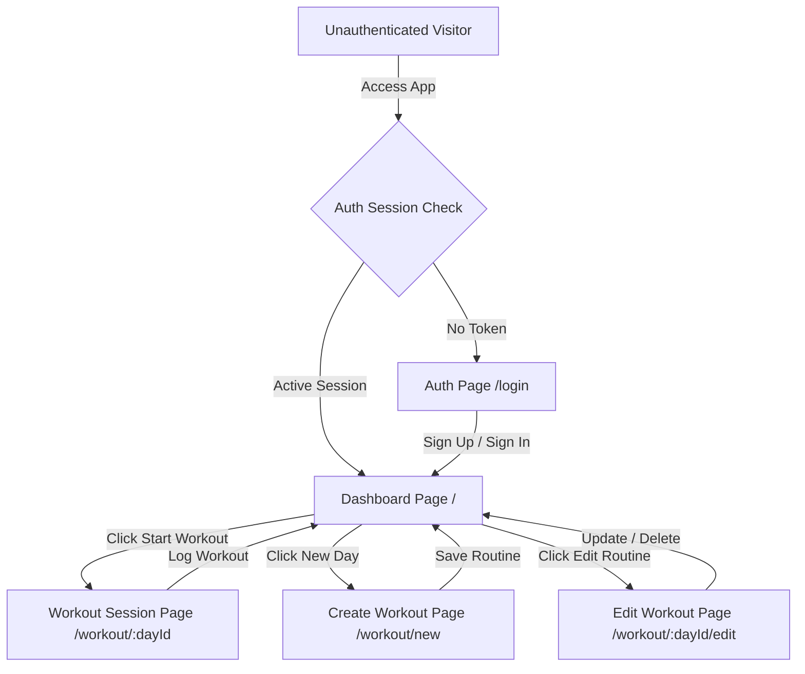
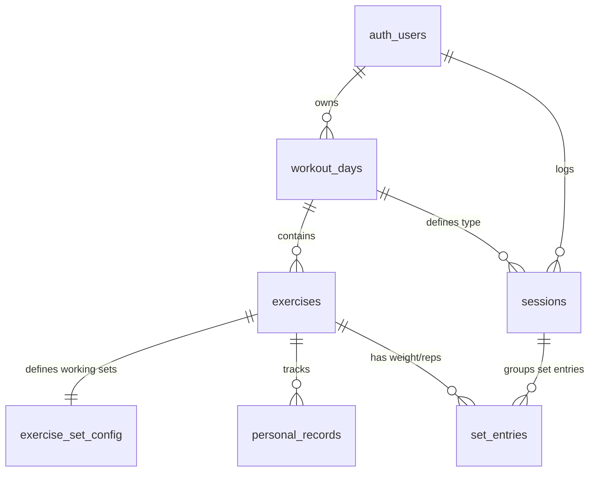

# System Architecture & Contributor Guide — RepStack

This document details the architectural layout, database schemas, state management systems, and user navigation routes of the RepStack Gym Tracker. It is designed to help junior developers and contributors quickly ramp up and make modifications to the codebase.

---

## 🗺️ User Flow & Routing Topology

RepStack uses **React Router v6** to manage page routing. Protected pages are wrapped in a `<ProtectedRoute>` component that verifies authentication status via the `useGymTracker` context hook.



### Route Index

- **`/login`**: Houses email login and registration forms. Built-in routing redirects back to the dashboard if a valid session exists.
- **`/`**: The central Hub displaying active routines, past workouts history, and a weekly volume charts dashboard.
- **`/workout/:dayId`**: The active workout dashboard displaying warmup/working set inputs, customizable rest timers, and the workout completion commit action.
- **`/workout/new`**: Dedicated routine configuration page to build a new training day tab.
- **`/workout/:dayId/edit`**: Routine modifications page allowing inline renames, additions/deletions of exercises, set configuration counts, or cascading deletion of the entire day.

---

## 🗄️ Database Schema & Relational Model

The backend is built in **Supabase (PostgreSQL)** with Row Level Security (RLS) enabled. Primary keys are configured as auto-incrementing numbers (`int8`).



### Table Definitions

1. **`workout_days`**:
   - `id` (int8, PK): Auto-incrementing identifier.
   - `user_id` (uuid, FK): Points to `auth.users.id` (cascade delete).
   - `name` (text): e.g., "Push Day".
   - `sort_order` (int4): For ordering navigation tabs.

2. **`exercises`**:
   - `id` (int8, PK): Auto-incrementing identifier.
   - `workout_day_id` (int8, FK): Points to `workout_days.id` (cascade delete).
   - `name` (text): e.g., "Incline Bench Press".
   - `notes` (text): Details or instructions (nullable).
   - `image_url` (text): Custom photo uploads (nullable).
   - `sort_order` (int4): Display order within the day's routine.

3. **`exercise_set_config`**:
   - `id` (int8, PK): Auto-incrementing identifier.
   - `exercise_id` (int8, FK, UNIQUE): Points to `exercises.id` (cascade delete).
   - `working_set_count` (int4): Number of target sets for the exercise (default: 3).

4. **`sessions`**:
   - `id` (int8, PK): Auto-incrementing identifier.
   - `user_id` (uuid, FK): Points to `auth.users.id` (cascade delete).
   - `workout_day_id` (int8, FK): Points to `workout_days.id` (cascade delete).
   - `performed_on` (date): The training calendar date.

5. **`set_entries`**:
   - `id` (int8, PK): Auto-incrementing identifier.
   - `session_id` (int8, FK): Points to `sessions.id` (cascade delete).
   - `exercise_id` (int8, FK): Points to `exercises.id` (cascade delete).
   - `set_type` (text): `'warmup'` or `'working'`.
   - `set_index` (int4): Index of the set (0-indexed).
   - `weight` (numeric): Weight lifted (nullable).
   - `reps` (int4): Repetitions completed (nullable).

6. **`personal_records`**:
   - `id` (int8, PK): Auto-incrementing identifier.
   - `exercise_id` (int8, FK, UNIQUE): Points to `exercises.id` (cascade delete).
   - `max_weight` (numeric): Maximum weight successfully lifted.
   - `max_weight_reps` (int4): Reps completed at max weight.
   - `achieved_on` (date): Date of achievements.
   - `previous_weight` (numeric): History trace (nullable).

---

## 🔗 Cross-Routine Shared Exercise History & PR Tracking

In gym routines, the same fundamental exercise (e.g. *"Incline Bench Press"*) may appear in multiple workout days (e.g., both *"Push"* and *"Chest & Back"*). RepStack unifies them seamlessly:

1. **Normalized Exercise Identity**:
   - Helper functions in `src/utils/exerciseUtils.ts` normalize exercise names (`name.trim().toLowerCase()`).
2. **Global Last-Performance Lookup**:
   - When a workout session opens, the system queries the entire workout history across all days for any prior occurrence of that exercise name.
   - If you logged `25 kg` on a Monday *"Push"* day, opening *"Chest & Back"* on Thursday immediately pre-populates your working sets with `25 kg` as your last logged reference.
3. **Cross-Routine Personal Records (PR)**:
   - When a session is submitted, PR checks evaluate against the all-time highest record for that normalized name across all routines.
   - Breaking a record automatically updates the PR for that exercise across all workout days where it is used.
4. **Interactive Progression Line Graph (`ExerciseProgressionChart.tsx`)**:
   - Placed directly on the dashboard, allowing users to filter by any exercise and view chronological progress (S1, S2, ..., NOW) with SVG glow curves, 1RM estimations, and volume trends.

---

## ⚡ State Management Flow (MBI Pattern)

RepStack implements the Model-View-Intent pattern by combining the React **Context API** (`GymTrackerContext.tsx`) and the **useReducer** hook (`gymTrackerReducer.ts`).

### State Machine Lifecycle

```
[User Action / Form Submit]
         ↓
[API Client Mutator Call (useSupabaseQuery.ts)]
         ↓
[Database Writes & Fetch Response]
         ↓
[Context Dispatch Action]
         ↓
[Reducer State Mutation (gymTrackerReducer.ts)]
         ↓
[Global State Re-render Trigger]
```

### Central Reducer Action Index

All database operations are synchronized locally through these actions in `gymTrackerReducer.ts`:

- `START_LOADING` / `SET_ERROR`: Standard API request cycle handlers.
- `SET_ALL_DATA`: Invoked on login; hydrates the app state.
- `ADD_WORKOUT_DAY` / `UPDATE_WORKOUT_DAY` / `DELETE_WORKOUT_DAY`: Handles routines CRUD.
- `ADD_EXERCISE` / `UPDATE_EXERCISE` / `REMOVE_EXERCISE`: Handles routine exercise configs.
- `UPDATE_EXERCISE_CONFIG`: Modifies target sets counts.
- `LOG_SESSION`: Commits a session log, inserts set entries, and updates personal records (PR) simultaneously.

---

## 👶 Contributor Guide: How to Extend the Codebase

### Adding a New Column / Feature (Example: Adding Cardio Duration Tracking)

If you need to track cardiovascular duration for exercises, follow these steps:

#### Step 1: Update the Database Schema

Execute the database update in the Supabase SQL editor:

```sql
ALTER TABLE set_entries ADD COLUMN duration_seconds int4;
```

#### Step 2: Update runtime Zod Schemas

Edit `src/schemas/setEntries.ts` to expect the new field:

```typescript
export const SetEntrySchema = z.object({
  id: z.number(),
  session_id: z.number(),
  exercise_id: z.number(),
  set_type: z.string(),
  set_index: z.number(),
  weight: z.coerce.number().nullable(),
  reps: z.number().nullable(),
  duration_seconds: z.number().nullable().optional(), // Added
});
```

#### Step 3: Extend Types & Reducer Logic

If the UI state needs to store the duration, edit the `MockExercise` interface in `src/types/mock.ts` and ensure mapper functions in `Dashboard.tsx` and `WorkoutSession.tsx` extract the value.

#### Step 4: Update UI View

Modify the inputs inside `src/components/ExerciseCard.tsx` to conditionally render a stopwatch or duration input field for cardio exercises, and trigger the corresponding input handlers.

---

## 🔒 Securing Supabase Rows with RLS policies

Ensure all tables have Row Level Security active so users cannot view other athletes' logs:

1. **For User Owned Tables** (`workout_days`, `sessions`):

   ```sql
   CREATE POLICY "Users can manage their own data"
   ON workout_days
   FOR ALL
   TO authenticated
   USING (auth.uid() = user_id)
   WITH CHECK (auth.uid() = user_id);
   ```

2. **For Nested Child Tables** (`exercises`, `exercise_set_config`, `set_entries`, `personal_records`):
   Check authorization by traversing relations, e.g., for `exercises`:
   ```sql
   CREATE POLICY "Users can manage exercises in their routines"
   ON exercises
   FOR ALL
   TO authenticated
   USING (
     EXISTS (
       SELECT 1 FROM workout_days
       WHERE workout_days.id = exercises.workout_day_id
       AND workout_days.user_id = auth.uid()
     )
   );
   ```
